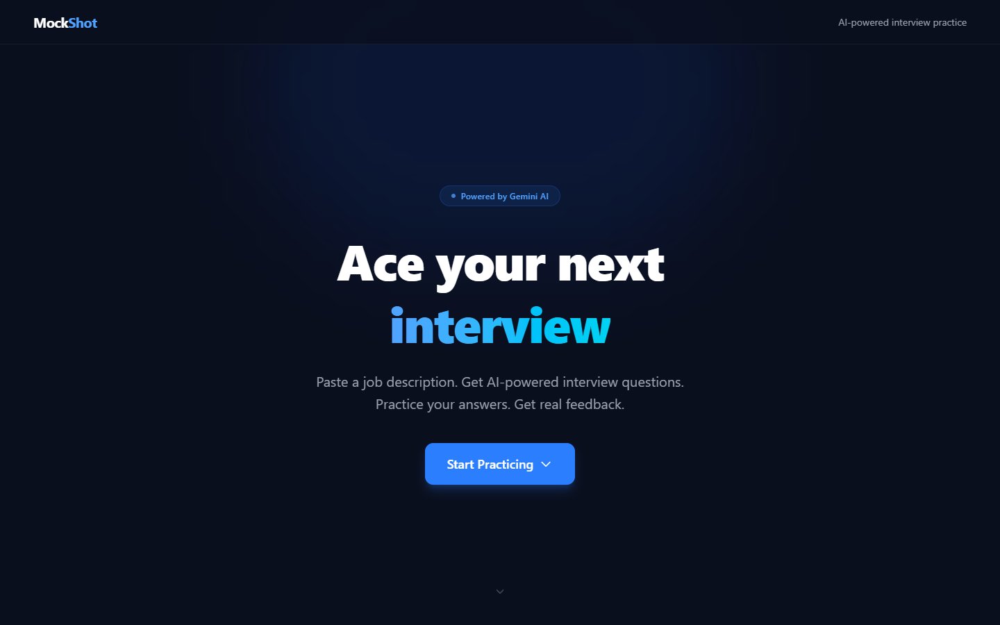
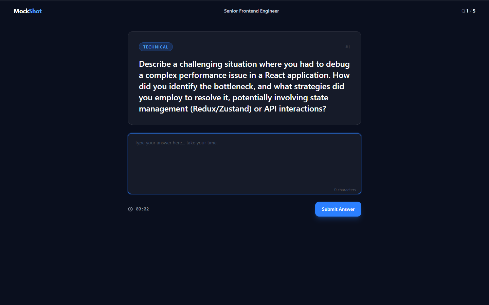
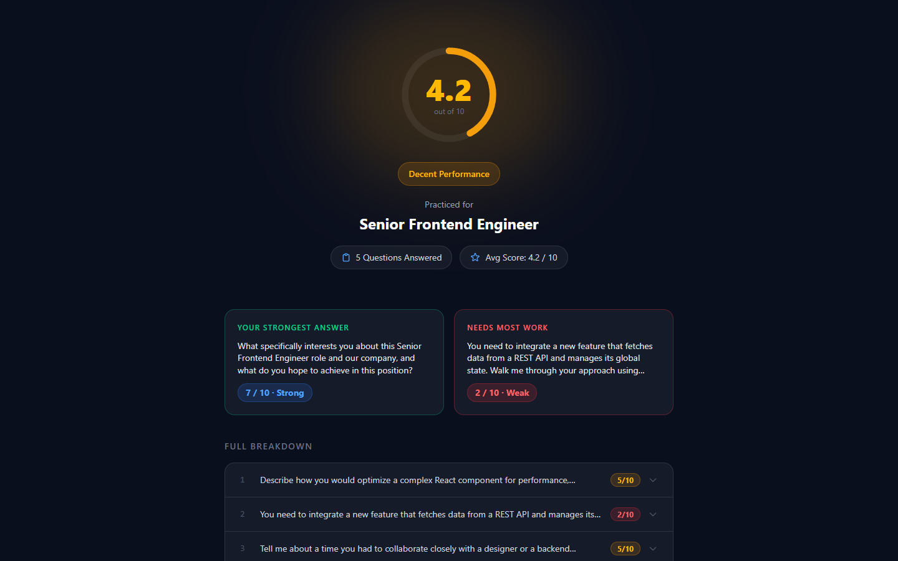
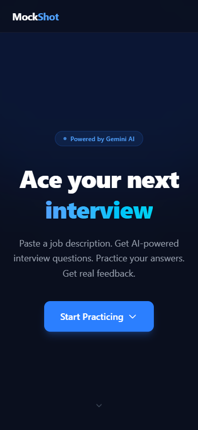
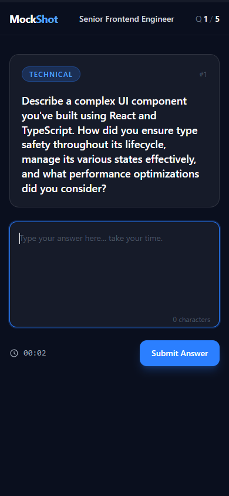
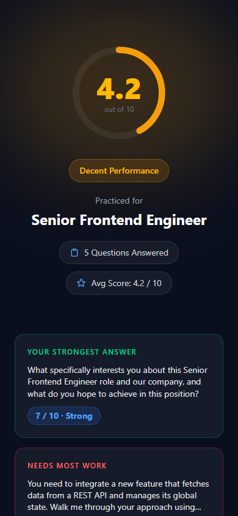

# MockShot 🎯
### AI-Powered Mock Interview Trainer

MockShot analyzes any job description and generates tailored interview questions. Answer them, get real-time AI feedback, and see your full performance report.

**Live demo:** [mockshot.onrender.com](https://mockshot.onrender.com)

---

## Screenshots

### Landing Page


### Interview Screen


### Results


<details>
<summary>Mobile screenshots</summary>

| Landing | Interview | Results |
|---------|-----------|---------|
|  |  |  |

</details>

---

## Features

- Paste any job description → get 5 tailored interview questions (2 technical, 2 behavioral, 1 motivation)
- AI evaluates every answer with a score (1–10), detailed feedback, strengths & improvements
- Full results report with overall score, animated score circle, and per-question breakdown
- Session history saved to MongoDB
- Works without a database — results computed client-side via router state
- Fully responsive — works on mobile

---

## Tech Stack

| Layer    | Tech                        |
|----------|-----------------------------|
| Frontend | React 19, Tailwind CSS v4   |
| Backend  | Node.js, Express            |
| Database | MongoDB + Mongoose          |
| AI       | Google Gemini API           |
| Deploy   | Render                      |

---

## Run Locally

1. **Clone the repo**
   ```bash
   git clone https://github.com/nimrodne1/MockShot.git
   cd mockshot
   ```

2. **Install dependencies**
   ```bash
   npm run install:all
   ```

3. **Configure environment variables**

   Create `server/.env`:
   ```
   MONGO_URI=mongodb://localhost:27017/mockshot
   GEMINI_API_KEY=your_gemini_api_key_here
   PORT=5000
   ```

   Create `client/.env`:
   ```
   VITE_API_URL=http://localhost:5000
   ```

4. **Start the dev servers**
   ```bash
   npm run dev
   ```

   - Frontend: http://localhost:5173
   - Backend: http://localhost:5000

---

## Project Structure

```
mockshot/
├── client/              # React + Vite frontend
│   └── src/
│       ├── api/         # Axios API layer
│       ├── constants.js # Score helpers
│       └── pages/       # LandingPage, InterviewPage, ResultsPage
├── server/              # Express backend
│   ├── controllers/     # Business logic
│   ├── models/          # Mongoose schemas
│   └── routes/          # API routes
└── package.json         # Root scripts (build, start, dev)
```

---

## Deploy on Render

1. Push this repo to GitHub (public)
2. Go to [render.com](https://render.com) → **New Web Service** → connect the repo
3. Configure:

   | Setting       | Value          |
   |---------------|----------------|
   | Build Command | `npm run build` |
   | Start Command | `npm start`     |
   | Node Version  | `18`            |

4. Add environment variables in the Render dashboard:
   ```
   MONGO_URI=your_mongodb_atlas_uri
   GEMINI_API_KEY=your_gemini_api_key
   NODE_ENV=production
   ```

5. Click **Deploy** and wait ~2 minutes for the build

---

## API Endpoints

| Method | Endpoint | Description |
|--------|----------|-------------|
| `POST` | `/api/interview/start` | Analyze job description, return 5 questions |
| `POST` | `/api/interview/answer` | Evaluate an answer, return score + feedback |
| `GET`  | `/api/interview/summary/:id` | Get full session summary |
| `GET`  | `/api/health` | Health check |
